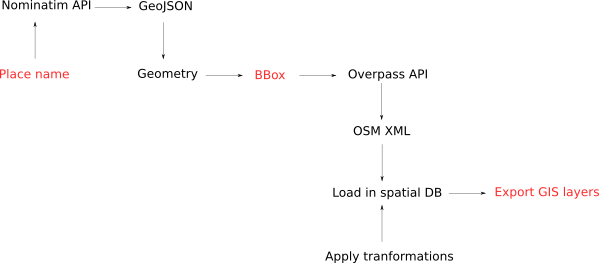
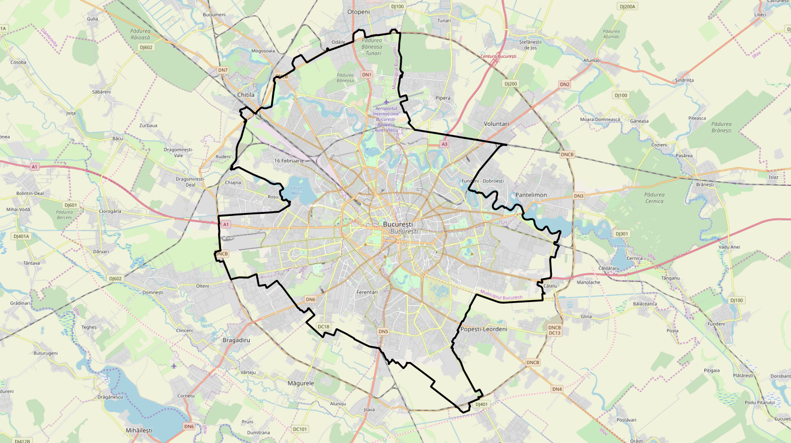
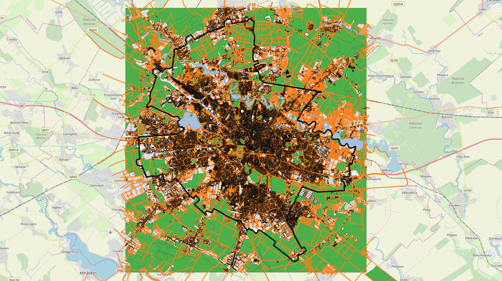
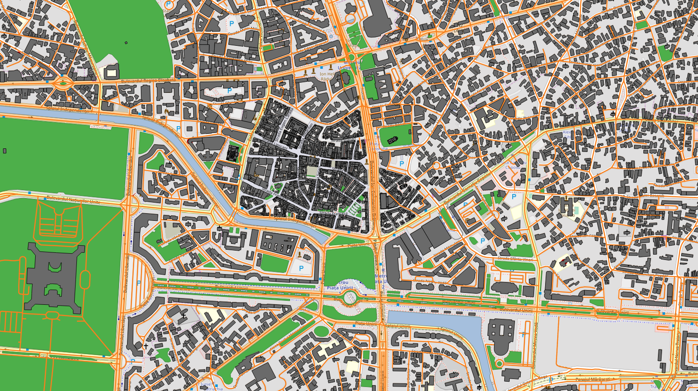

# OSM  - Extraction and transformation to GIS layers

Figure 1 shows the sequence of actions that are performed to retrieve OSM data and transform them into GIS layers.



Figure 1. OSM data flow transformation

The sequence starts either by specifying a place name or by specifying an OSM bbox.

If the user set a place name, the [Nominatim API](https://nominatim.org) is requested  to search in the OSM database all objects that match the given text.
A geojson file is returned with a geometry representation of the OSM objects.
The first Polygon or MutiPolygon found in the geojson is collected and its bounding box is computed.

The bounding box is formated to feed the overpass syntax and create the query send to the server.

```xml
[maxsize:1073741824][bbox:47.6377566,-2.7976946,47.6530896,-2.7694425];
(
	node;
	way;
	relation;
);
(._;>;);
out;
```

The response of the query is stored in an OSM xml file. 
The XML file is loaded in a relational spatial database (H2GIS or PostGIS).
Thanks to [H2GIS OSM driver](http://www.h2gis.org/docs/1.5.0/OSMRead/) that performs this task,
1O tables are produced. They represent the whole OSM data model (node, way, relation, node_tag...).


Once the 10 tables have been created, a set of SQL scripts are run to transform the OSM data into GIS layers. 
These scripts are grouped to offer 3 kind of transformations : 
- point geometries,
- line geometries,
- polygon geometries

For each transformation, it is possible to specify : 
- the epsg code of the output geometries
- a list of OSM keys to filter the OSM objects. e.g ["building", "water", "landuse"]
- a list of columns that we want to keep in the GIS layer

The result of the transformation is stored in a spatial table in the database. Thanks to OrbisData functions
that permits to save it in a file.

The figure 2 shows the Nominatim area for the place name Bucarest.



Figure 2. Bucarest place name area


The figure 3 and 4 shows 4 GIS layers extracted for the place name Buracest. Vegetation in green, road in orange,
building in grey, water in blue.


Figure 3. Bucarest GIS layers


Figure 4. Zoom on Bucarest GIS layers


