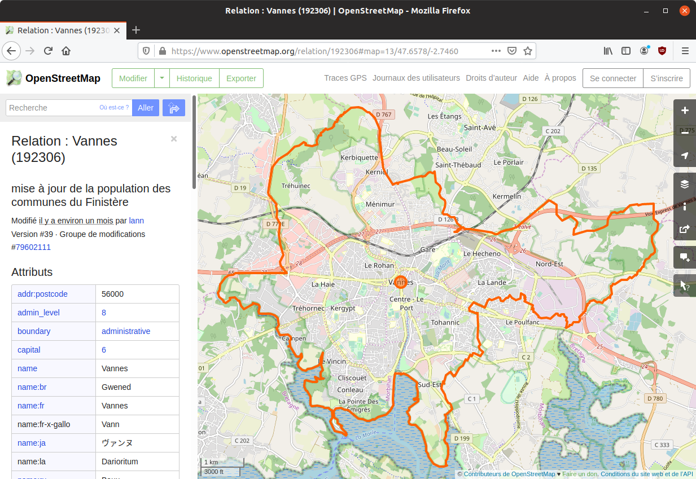
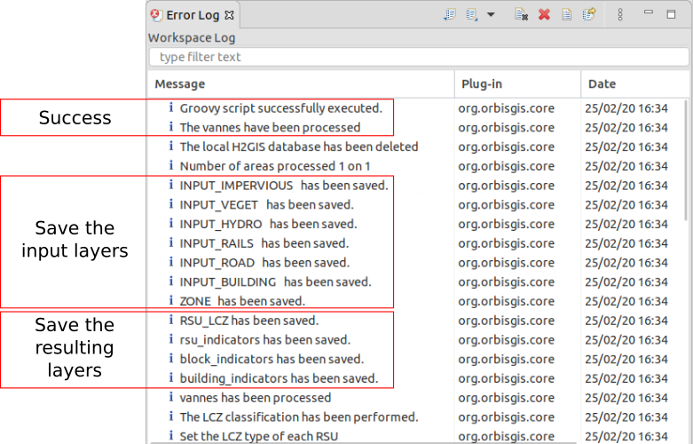
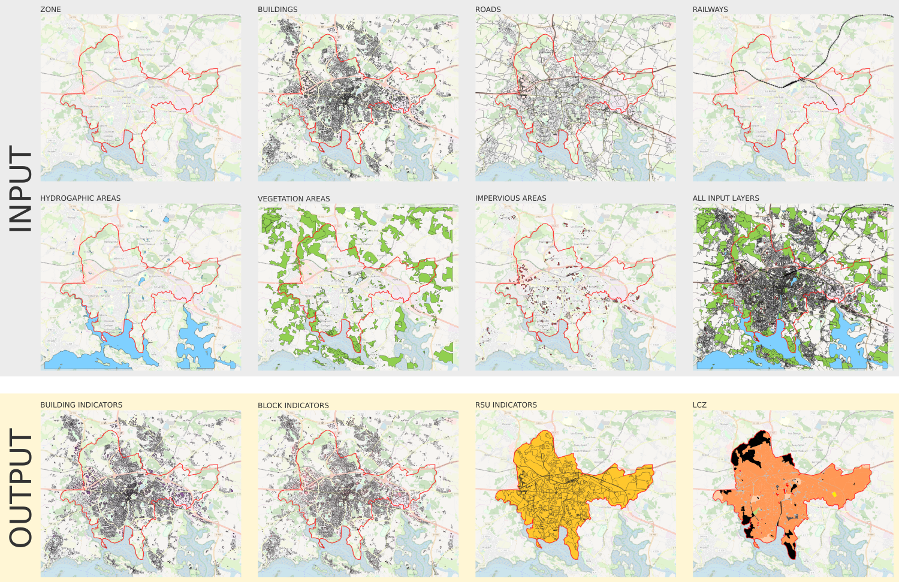

# Run Geoclimate with OSM

As seen in [this section](../../chain_documentation/workflow/osm/coupling_with_geoclimate.md), four OSM workflow configuration files are available on the Geoclimate Github repository [here](https://github.com/orbisgis/geoclimate/tree/master/processingchain/src/test/resources/org/orbisgis/orbisprocess/geoclimate/processingchain/config):

1. [Using an envelop and exporting in a folder](https://github.com/orbisgis/geoclimate/blob/master/processingchain/src/test/resources/org/orbisgis/orbisprocess/geoclimate/processingchain/config/osm_workflow_envelope_folderoutput.json) 
2. [Using mixed filters and exporting in a folder](https://github.com/orbisgis/geoclimate/blob/master/processingchain/src/test/resources/org/orbisgis/orbisprocess/geoclimate/processingchain/config/osm_workflow_mixedfilter_folderoutput.json)
3. [Using a placename and exporting in a database](https://github.com/orbisgis/geoclimate/blob/master/processingchain/src/test/resources/org/orbisgis/orbisprocess/geoclimate/processingchain/config/osm_workflow_placename_dboutput.json)
4. [Using a placename and exporting in a folder](https://github.com/orbisgis/geoclimate/blob/master/processingchain/src/test/resources/org/orbisgis/orbisprocess/geoclimate/processingchain/config/osm_workflow_placename_folderoutput.json)


Below are illustrated the cases n°4 and n°1, in the DBeaver environment.

## Using a placename

In this use case, we want to process OSM input data, extracted from the french city (placename) of [Vannes](https://www.openstreetmap.org/relation/192306). 



The resulting layers will be exported as flat files in a dedicated output folder at the following address : `/home/geoclimate/osm/`

### 1. Configuration file

Download this file : [osm_workflow_placename_folderoutput.json](https://github.com/orbisgis/geoclimate/blob/master/processingchain/src/test/resources/org/orbisgis/orbisprocess/geoclimate/processingchain/config/osm_workflow_placename_folderoutput.json) and open it in a text editor.

```json
{
    "description" :"Conf file to run the OSM workflow and store the resultst in a folder",
    "geoclimatedb" : {
        "path" : "/tmp/.../geoclimate_db;AUTO_SERVER=TRUE",
        "delete" :true
    },
    "input" : {
        "osm" : ["kerfot", "plouezec"]},
    "output" :{
     "folder" : "/tmp/..."},
    "parameters":
    {"distance" : 1000,
        "indicatorUse": ["LCZ", "URBAN_TYPOLOGY", "TEB"],
        "svfSimplified": false,
        "prefixName": "",
        "mapOfWeights":
        {"sky_view_factor": 1,
            "aspect_ratio": 1,
            "building_surface_fraction": 1,
            "impervious_surface_fraction" : 1,
            "pervious_surface_fraction": 1,
            "height_of_roughness_elements": 1,
            "terrain_roughness_class": 1},
        "hLevMin": 3,
        "hLevMax": 15,
        "hThresholdLev2": 10
    }
}
```

Then:

1. In the `geoclimatedb` part, adapt the output database address (*e.g* `"path" : "/home/geoclimate/osm/db/geoclimate_db;AUTO_SERVER=TRUE",`)
2. In the `input` part, replace `"kerfot", "plouezec"` by `"vannes"`
3. In the `output` part, replace `"folder" : "/tmp/..."},` by `"folder" : "/home/geoclimate/osm/"},`
4. Save these modifications.


### 2. DBeaver

Launch DBeaver and open a new Groovy console (if not already installed, please follow these [instructions](../execution_tools.md)).

As explained before we will execute the OSM process, which is in the workflow groovy file : `geoclimate.workflow.OSM()`

So, in the Groovy console, copy and paste the following script

```groovy
@GrabResolver(name='orbisgis', root='https://nexus.orbisgis.org/repository/orbisgis/')
@Grab(group='org.orbisgis.orbisprocess', module='geoclimate', version='1.0.0-SNAPSHOT')

import org.orbisgis.orbisprocess.geoclimate.Geoclimate
Geoclimate.logger = logger

def process = Geoclimate.Workflow.OSM()
process.execute(configurationFile:'/home/geoclimate/osm/osm_workflow_placename_folderoutput.json')
                   
logger.info process.results.outputMessage
```

Where `'/home/geoclimate/osm/osm_workflow_placename_folderoutput.json'` is the place where the configuration file is stored.

Then, click on  to execute the workflow.

#### Log messages

If you added the `Geoclimate.logger = logger` and `logger.info process.results.outputMessage` instructions in DBeaver, you are able to read the logs. These logs show you where the Geoclimate chain is by listing all the tasks in progress and completed.

If not already done, open the `Error Log` console, thanks to the `Windows` / `Display the view` menus. Then start processing and follow the progress in the logs (see an example below, at the end of the process).



### 3. Results

In your output folder `/home/geoclimate/osm/` you now have a new sub-folder called `osm_vannes` in which are stored the resulting layers, saved as `.geojson` files. In particular, you have:

- the 7 input layers (`INPUT_BUILDING`, `INPUT_ROAD`, `INPUT_RAILS`, `INPUT_VEGET`, `INPUT_HYDRO`, `INPUT_IMPERVIOUS` and `ZONE`)
- the 4 resulting layers (`BUILDING_INDICATORS`, `BLOCK_INDICATORS`, `RSU_INDICATORS`, `RSU_LCZ`)


These files can be opened in most of the GIS applications (e.g QGIS, OrbisGIS, Openjump, ...).





## Using a bbox

### 1. Configuration file

Download this file : [osm_workflow_envelope_folderoutput.json](https://github.com/orbisgis/geoclimate/blob/master/processingchain/src/test/resources/org/orbisgis/orbisprocess/geoclimate/processingchain/config/osm_workflow_envelope_folderoutput.json) and open it in a text editor.

```json
{
  "description" :"Configuration file to run the OSM workflow with an output folder",
  "geoclimatedb" : {
        "path" : "/tmp/.../geoclimate_db;AUTO_SERVER=TRUE",
        "delete" :true
    },
  "input" : {
     "osm":[[38.89557963573336,-77.03930318355559,38.89944983078282,-77.03364372253417]]},
  "output" :{
     "folder" : "/tmp/..."},
  "parameters":
    {"distance" : 1000,
        "indicatorUse": ["LCZ", "URBAN_TYPOLOGY", "TEB"],
        "svfSimplified": false,
        "prefixName": "",
        "mapOfWeights":
        {"sky_view_factor": 1,
            "aspect_ratio": 1,
            "building_surface_fraction": 1,
            "impervious_surface_fraction" : 1,
            "pervious_surface_fraction": 1,
            "height_of_roughness_elements": 1,
            "terrain_roughness_class": 1},
        "hLevMin": 3,
        "hLevMax": 15,
        "hThresholdLev2": 10
    }
}
```

Then:

1. In the `geoclimatedb` part, adapt the output database address (*e.g* `"path" : "/home/geoclimate/osm/db/geoclimate_db;AUTO_SERVER=TRUE",`)
2. In the `input`  / `osm` part, adapt the coordinates of your bounding box
3. In the `output` part, replace `"folder" : "/tmp/..."},` by `"folder" : "/home/geoclimate/osm/"},`
4. Save these modifications.


### 2. DBeaver

Launch DBeaver and open a new Groovy console (if not already installed, please follow these [instructions](../execution_tools.md)).

As explained before we will execute the OSM process, which is in the workflow groovy file : `geoclimate.workflow.OSM()`

So, in the Groovy console, copy and paste the following script

```groovy
@GrabResolver(name='orbisgis', root='https://nexus.orbisgis.org/repository/orbisgis/')
@Grab(group='org.orbisgis.orbisprocess', module='geoclimate', version='1.0.0-SNAPSHOT')

import org.orbisgis.orbisprocess.geoclimate.Geoclimate
Geoclimate.logger = logger

def process = Geoclimate.Workflow.OSM()
process.execute(configurationFile:'/home/geoclimate/osm/osm_workflow_envelope_folderoutput.json.json')
                   
logger.info process.results.outputMessage
```

Where `'/home/geoclimate/osm/osm_workflow_envelope_folderoutput.json.json'` is the place where the configuration file is stored.

Then, click on  to execute the workflow.


## Script to be executed in DBeaver

```groovy
// Declaration of the maven repository
@GrabResolver(name='orbisgis', root='https://nexus.orbisgis.org/repository/orbisgis/')

// Declaration of our Nexus repository, where the geoclimate project is stored
@Grab(group='org.orbisgis.orbisprocess', module='geoclimate', version='1.0.0-SNAPSHOT')

// Importing needed classes
// In the Geoclimate object, we already have all the classes that allow access to the processes
import org.orbisgis.orbisprocess.geoclimate.Geoclimate

// We declare the tool that register and display the logs
Geoclimate.logger = logger

// The OSM process is stored in a variable called "process" (and it instantiates the process at the same time)
def process = Geoclimate.Workflow.OSM()

// We execute the process (OSM) using the only input parameter : the configuration file
process.execute(configurationFile:['your local configuration file adress'])
// example : process.execute(configurationFile:'/tmp/osm_workflow_placename_folderoutput.json')
                   
// Ask to display the logs (can be useful to see the progress of the process.)
logger.info process.results.outputMessage
```


