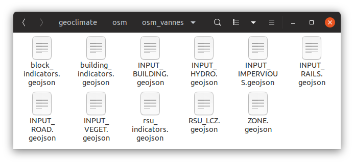
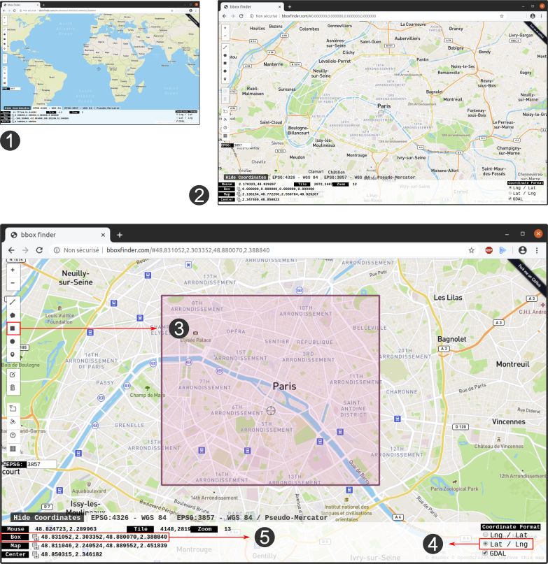
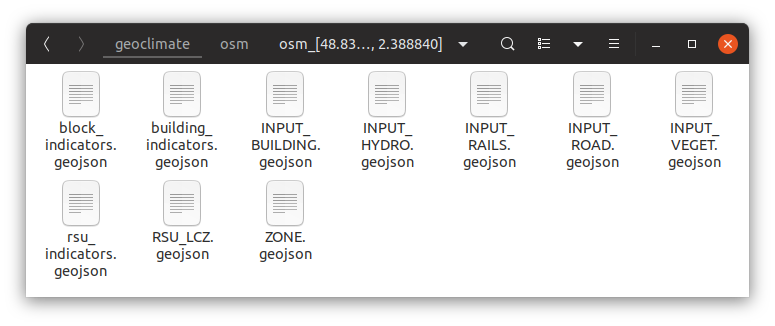
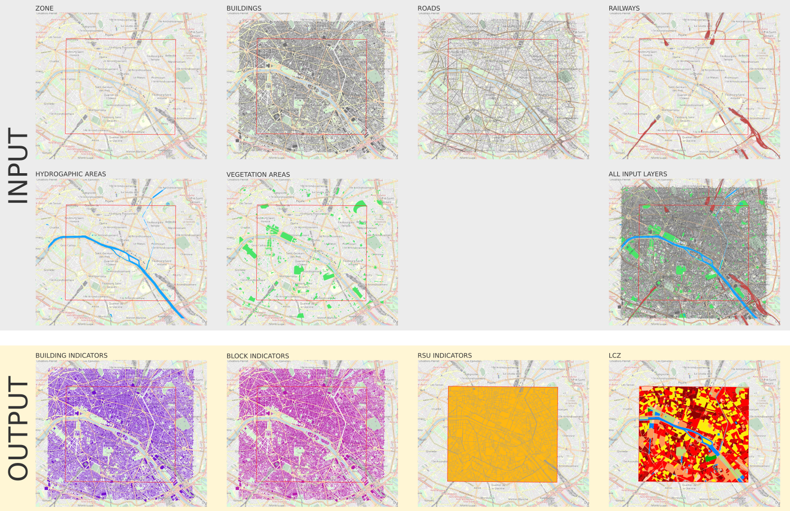

# Run Geoclimate with OSM

As seen in [this section](../../chain_documentation/workflow/description.md#Configuration-file), four OSM workflow configuration files are available on the Geoclimate Github repository [here](https://github.com/orbisgis/geoclimate/tree/v1.0.0-RC1/osm/src/test/resources/org/orbisgis/orbisprocess/geoclimate/osm/config):

1. [Using an envelop and exporting in a folder](https://github.com/orbisgis/geoclimate/blob/v1.0.0-RC1/osm/src/test/resources/org/orbisgis/orbisprocess/geoclimate/osm/config/osm_workflow_envelope_folderoutput.json) 
2. [Using mixed filters and exporting in a folder](https://github.com/orbisgis/geoclimate/blob/v1.0.0-RC1/osm/src/test/resources/org/orbisgis/orbisprocess/geoclimate/osm/config/osm_workflow_mixedfilter_folderoutput.json)
3. [Using a placename and exporting in a database](https://github.com/orbisgis/geoclimate/blob/v1.0.0-RC1/osm/src/test/resources/org/orbisgis/orbisprocess/geoclimate/osm/config/osm_workflow_placename_dboutput.json)
4. [Using a placename and exporting in a folder](https://github.com/orbisgis/geoclimate/blob/v1.0.0-RC1/osm/src/test/resources/org/orbisgis/orbisprocess/geoclimate/osm/config/osm_workflow_placename_folderoutput.json)


Below are illustrated the cases [n°4](#Using-a-placename) and [n°1](#Using-a-bounding-box), in the [DBeaver](../execution_tools.md#With-DBeaver) environment.

## Using a placename

In this use case, we want to process OSM input data, extracted from the french city (placename) of [Vannes](https://www.openstreetmap.org/relation/192306). 


The resulting layers will be exported as flat files in a dedicated output folder at the following address : `/home/geoclimate/osm/`

### 1. Configuration file

Download this file : [osm_workflow_placename_folderoutput.json](https://github.com/orbisgis/geoclimate/blob/v1.0.0-RC1/osm/src/test/resources/org/orbisgis/orbisprocess/geoclimate/osm/config/osm_workflow_placename_folderoutput.json) and open it in a text editor.

```json
{
    "description" :"Conf file to run the OSM workflow and store the resultst in a folder",
    "geoclimatedb" : {
        "path" : "/tmp/.../geoclimate_db;AUTO_SERVER=TRUE",
        "delete" :true
    },
    "input" : {
        "osm" : ["kerfot", "plouezec"]},
    "output" :{
     "folder" : "/tmp/..."},
    "parameters":
    {"distance" : 1000,
        "indicatorUse": ["LCZ", "URBAN_TYPOLOGY", "TEB"],
        "svfSimplified": false,
        "prefixName": "",
        "mapOfWeights":
        {"sky_view_factor": 1,
            "aspect_ratio": 1,
            "building_surface_fraction": 1,
            "impervious_surface_fraction" : 1,
            "pervious_surface_fraction": 1,
            "height_of_roughness_elements": 1,
            "terrain_roughness_class": 1},
        "hLevMin": 3,
        "hLevMax": 15,
        "hThresholdLev2": 10
    }
}
```

Then:

1. In the `geoclimatedb` part, adapt the working database address (*e.g* `"path" : "/home/geoclimate/osm/db/geoclimate_db;AUTO_SERVER=TRUE",`)
2. In the `input` part, replace `"kerfot", "plouezec"` by `"vannes"`
3. In the `output` part, replace `"folder" : "/tmp/..."},` by `"folder" : "/home/geoclimate/osm/"},`
4. Save these modifications.


### 2. DBeaver

Launch DBeaver and open a new Groovy console (if not already installed, please follow these [instructions](../execution_tools.md)).

As explained [before](../../chain_documentation/workflow/description.md#And-technically) we will execute the `OSM` process, which is in the workflow groovy file : `Geoclimate.Workflow.OSM()`

So, in the Groovy console, copy and paste the following script

```groovy
@GrabResolver(name='orbisgis', root='https://nexus.orbisgis.org/repository/orbisgis/')
@Grab(group='org.orbisgis.orbisprocess', module='geoclimate', version='1.0.0-RC1')

import org.orbisgis.orbisprocess.geoclimate.Geoclimate
Geoclimate.logger = logger

def process = Geoclimate.Workflow.OSM()
process.execute(configurationFile:'/home/geoclimate/osm/osm_workflow_placename_folderoutput.json')
                   
logger.info process.results.outputMessage
```

Where `'/home/geoclimate/osm/osm_workflow_placename_folderoutput.json'` is the place where the configuration file is stored.

Then, click on  to execute the workflow.

#### Log messages

If you added the `Geoclimate.logger = logger` and `logger.info process.results.outputMessage` instructions in DBeaver, you are able to read the logs. These logs show you where the Geoclimate chain is by listing all the tasks in progress and completed.

If not already done, open the `Error Log` console, thanks to the `Windows` / `Display the view` menus. Then start processing and follow the progress in the logs (see an example below, at the end of the process).


### 3. Results

In your output folder `/home/geoclimate/osm/` you now have a new sub-folder called `osm_vannes` in which are stored the resulting layers, saved as `.geojson` files. In particular, you have:

- the 7 input layers (`INPUT_BUILDING`, `INPUT_ROAD`, `INPUT_RAILS`, `INPUT_VEGET`, `INPUT_HYDRO`, `INPUT_IMPERVIOUS` and `ZONE`)
- the 4 resulting layers (`BUILDING_INDICATORS`, `BLOCK_INDICATORS`, `RSU_INDICATORS`, `RSU_LCZ`)



These files can be opened in most of the GIS applications (e.g [QGIS](https://www.qgis.org/), [OrbisGIS](http://orbisgis.org/), [OpenJUMP](http://www.openjump.org/), ...).


[Back to top](#Run-Geoclimate-with-OSM)

## Using a bounding box

In this example, we want to process an area (a bounding box - bbox) on top of the city center of [Paris](https://www.openstreetmap.org/relation/7444) (France). 

The resulting layers will be exported as flat files in a dedicated output folder at the following address : `/home/geoclimate/osm/`

### 1. Define the bbox

First we have to define the desired zone and then deduce its coordinates. To do so, you can follow these steps:

1. Go on the [bboxfinder.com](http://bboxfinder.com/) website,
2. Zoom on Paris,
3. With the icon, draw a rectangle to define the desired zone,
4. In the menu `Coordinate Format`, check `Lat / Lng` ,
5. Copy the coordinates noted in the `Box` line ().




### 2. Configuration file

Download this file : [osm_workflow_envelope_folderoutput.json](https://github.com/orbisgis/geoclimate/blob/v1.0.0-RC1/osm/src/test/resources/org/orbisgis/orbisprocess/geoclimate/osm/config/osm_workflow_envelope_folderoutput.json) , open it in a text editor, update the following informations and save it:

1. In the `geoclimatedb` part, adapt the working database address (*e.g* `"path" : "/home/geoclimate/osm/db/geoclimate_db;AUTO_SERVER=TRUE",`)

2. In the `input`  / `osm` part, adapt the coordinates of your bounding box with your own (in our example `48.831052,2.303352,48.880070,2.388840`)

3. In the `output` part, replace `"folder" : "/tmp/..."},` by `"folder" : "/home/geoclimate/osm/"`}

   

```json
{
  "description" :"Configuration file to run the OSM workflow with an output folder",
  "geoclimatedb" : {
        "path" : "/home/geoclimate/osm/db/geoclimate_db;AUTO_SERVER=TRUE",
        "delete" :true
    },
  "input" : {
     "osm":[[48.831052,2.303352,48.880070,2.388840]]},
  "output" :{
     "folder" : "/home/geoclimate/osm/"},
  "parameters":
    {"distance" : 0,
        "indicatorUse": ["LCZ", "URBAN_TYPOLOGY", "TEB"],
        "svfSimplified": false,
        "prefixName": "",
        "mapOfWeights":
        {"sky_view_factor": 1,
            "aspect_ratio": 1,
            "building_surface_fraction": 1,
            "impervious_surface_fraction" : 1,
            "pervious_surface_fraction": 1,
            "height_of_roughness_elements": 1,
            "terrain_roughness_class": 1},
        "hLevMin": 3,
        "hLevMax": 15,
        "hThresholdLev2": 10
    }
}
```


### 3. DBeaver

Launch DBeaver and open a new Groovy console (if not already installed, please follow these [instructions](../execution_tools.md)).

As explained before we will execute the OSM process, which is in the workflow groovy file : `Geoclimate.Workflow.OSM()`

So, in the Groovy console, copy and paste the following script

```groovy
@GrabResolver(name='orbisgis', root='https://nexus.orbisgis.org/repository/orbisgis/')
@Grab(group='org.orbisgis.orbisprocess', module='geoclimate', version='1.0.0-SNAPSHOT')

import org.orbisgis.orbisprocess.geoclimate.Geoclimate
Geoclimate.logger = logger

def process = Geoclimate.Workflow.OSM()
process.execute(configurationFile:'/home/geoclimate/osm/osm_workflow_envelope_folderoutput.json')
                   
logger.info process.results.outputMessage
```

Where `'/home/geoclimate/osm/osm_workflow_envelope_folderoutput.json'` is the place where the configuration file is stored.

Then, click on  to execute the workflow.


### 4. Results

In your output folder `/home/geoclimate/osm/` you now have a new sub-folder called `osm_[48.831052, 2.303352, 48.880070, 2.388840]` in which are stored the resulting layers, saved as `.geojson` files. In particular, you have:

- the 6 input layers (`INPUT_BUILDING`, `INPUT_ROAD`, `INPUT_RAILS`, `INPUT_VEGET`, `INPUT_HYDRO`, and `ZONE`) (Note that the `INPUT_IMPERVIOUS` table is not present since there is no input data in this area)
- the 4 resulting layers (`BUILDING_INDICATORS`, `BLOCK_INDICATORS`, `RSU_INDICATORS`, `RSU_LCZ`)



These files can be opened in most of the GIS applications (e.g [QGIS](https://www.qgis.org/), [OrbisGIS](http://orbisgis.org/), [OpenJUMP](http://www.openjump.org/), ...).




[Back to top](#Run-Geoclimate-with-OSM)
